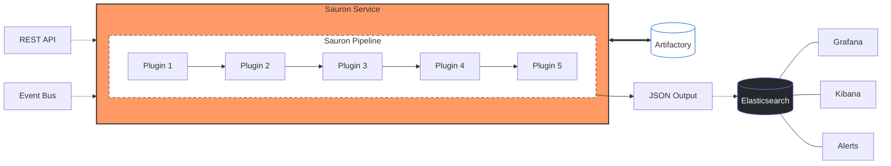
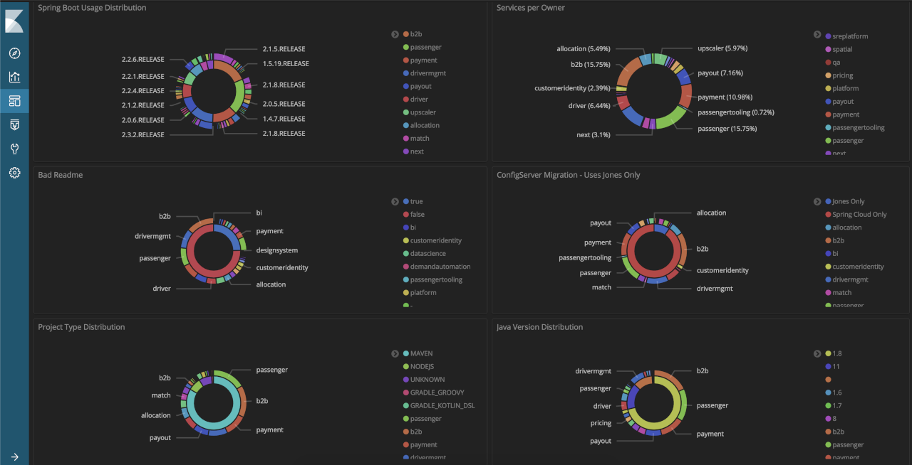

# Sauron - Version and Deployment Tracker

[](https://github.com/freenowtech/sauron/releases/latest)
[](https://github.com/freenowtech/sauron/releases/latest)
[](https://github.com/freenowtech/sauron/actions/workflows/build.yml)
[](https://github.com/freenowtech/sauron/actions/workflows/release-components.yml)
[](https://github.com/freenowtech/sauron/actions/workflows/release-plugins.yml)

Sauron, the all seeing eye!  
It is an automated service for tracking backend service migrations, dependency versions, and security vulnerabilities (CVEs). It generates comprehensive reports by analyzing 
service changes throughout the deployment lifecycle.

---

## Core Components

- **Sauron Core**: Common library shared by all plugins. [Details here](https://github.com/freenowtech/sauron/tree/main/sauron-core).
- **Sauron Service**: The main entry point and orchestrator.
- **Plugin System**: Extensible architecture (via [PF4J](https://github.com/pf4j/pf4j)) that allows adding logic without restarting the service.
- **Storage & Visualization**: Uses **Elasticsearch** for data storage and **Kibana** for dashboards.
- **Dependency-Track**: Integrated platform for identifying third-party component risks.

---

## Architecture Overview



---

## Getting Started

### Prerequisites
Ensure your local environment has the necessary configuration folders (e.g., .m2, .gradle, .pip) as they are mounted as volumes in the Docker containers.

### Quick Start with Docker Compose
1. **Build the service**:
   ```bash
   make
   ```
2. **Start the stack**:
   ```bash
   docker-compose -f docker-compose.yml --compatibility up
   ```
   This launches:
   - **Sauron Service**: http://localhost:8080
   - **Elasticsearch**: http://localhost:9200
   - **Kibana**: http://localhost:5601

### Manual Docker Execution
```bash
docker run \
    -e SPRING_CONFIG_LOCATION="/sauron/config/sauron-service.yml" \
    -e SPRING_PROFILES_INCLUDE="local" \
    --mount type=bind,source=${PWD}/docker/config/sauron-service.yml,destination=/sauron/config/sauron-service.yml,readonly \
    --mount type=bind,source=${PWD}/plugins,destination=/sauron/plugins \
    --mount type=bind,source=${HOME}/.m2,destination=/root/.m2 \
    --mount type=bind,source=${HOME}/.gradle,destination=/root/.gradle \
    --mount type=bind,source=${HOME}/.pip,destination=/root/.pip \
    --mount type=bind,source=${HOME}/.npmrc,destination=/root/.npmrc \
    --mount type=bind,source=${HOME}/.ssh,destination=/root/.ssh,readonly \
    --name=sauron -p 8080:8080 \
    ghcr.io/freenowtech/sauron/sauron-service:latest
```

---

## Configuration

Settings can be managed via environment variables:

- `SPRING_CONFIG_LOCATION`: Path to your local configuration file (YAML or Properties).
- `SPRING_CLOUD_CONFIG_URI`: URL for remote Spring Cloud Config Server.

Refer to [sauron-service.yml](https://github.com/freenowtech/sauron/blob/main/sauron-service/docker/config/sauron-service.yml) for a configuration example.

---

## Usage

### 1. Initialize Elasticsearch Templates
Before triggering builds, apply the index templates:
```bash
elasticsearch/sauron-template.sh
elasticsearch/dependencies-template.sh
```

### 2. Trigger a Build
Use the REST API to initiate a pipeline run. See [Swagger UI](http://localhost:8080/v2/api-docs) for full details.

**Example Request:**
```bash
curl -X POST 'http://localhost:8080/api/v1/build' \
    -H 'Content-Type: application/json' \
    -d '{
      "serviceName": "MyService",
      "repositoryUrl": "https://github.com/freenowtech/sauron.git",
      "commitId": "latest",
      "owner": "Sauron",
      "environment": "production"
    }'
```

### 3. Visualize Data
Import the [default Kibana Dashboard](https://github.com/freenowtech/sauron/blob/main/sauron-service/kibana/kibana.ndjson) to view your service data.



---

## Plugin System

Sauron's modularity comes from its plugins. Plugins are reloaded every **5 minutes**, or manually via `/api/v1/reload`.

### Key Official Plugins
- **console-output**: Prints the DataSet to `sysout`.
- **data-sanitizer**: Sanitizes data before being processed by Sauron pipeline.
- **git-checkout**: Clones the source code.
- **dependency-checker**: Generates CycloneDX SBOMs.
- **dependencytrack-publisher**: Sends data to Dependency-Track.
- **maven-report**: Retrieves data from `pom.xml` file.
- **elasticsearch-output**: Persists results to Elasticsearch.
- **protocw-checker**: Checks whether a service is using `protoc`, and `protoc wrapper`.
- **logs-report**: Checks if logs are being produced by a service.
- **kubernetesapi-report**: Retrieves annotations and labels assigned to a resource.
- **sonarapi-report**: Retrieves service related data as Code Coverage.
- **thanosapi-report**: Retrieves service related data as RPM and Circuit Breaker metrics.
- **readme-report**: Checks whether a service has a README.md file in its root folder. 
- **cleanup**: Purges the workspace after the pipeline finishes.

### Creating a New Plugin
1. **Install the archetype**:
   ```bash
   cd sauron-plugin-archetype
   mvn clean install
   ```
2. **Generate the skeleton**:
   ```bash
   mvn archetype:generate -DarchetypeArtifactId=sauron-plugin-archetype
   ```
3. **Implement logic**: Override the apply method in your generated class.
   ```java
   package com.freenow.sauron.plugins;
   
   import com.freenow.sauron.model.DataSet;
   import com.freenow.sauron.properties.PluginsConfigurationProperties;
   import org.pf4j.Extension;
   
   @Extension
   public class MyPlugin implements SauronExtension
   {
       @Override
       public DataSet apply(PluginsConfigurationProperties properties, DataSet input)
       {
           // @TODO: Your magic here
           return input;
       }
   }
   ```
4. **Plugin configuration**: To provide extra configuration to the plugin, add your configuration to the service configurations and it will be available at `PluginsConfigurationProperties`.
   ```yaml
   sauron:
    plugins:
        my-plugin:
            url: https://my-plugin.com
   ```  
   ```java
   @Extension
   public class MyPlugin implements SauronExtension
   {
      @Override
      public DataSet apply(PluginsConfigurationProperties properties, DataSet input)
      {
         properties.getPluginConfigurationProperty("my-plugin", "url").ifPresent(url -> System.out.println(url) );
         return input;
      }
   }
   ```   
5. **Deploy**: Add your JAR to the configured plugin repository (Local or Artifactory).
